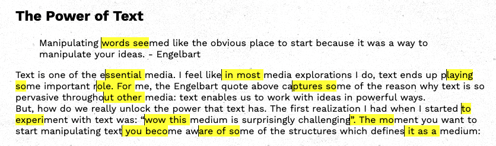

# Manoeuvre

This browser extension makes designMode="on" the default all sites and allows for rich text editing of any text of any webpage. Currently the extension only allows for concurrent selection of multiple sections of text.

This browser extension is a **design exploration** and is **not stable enough for day-to-day use**. 

concurrent text selection with Manoeuvre
